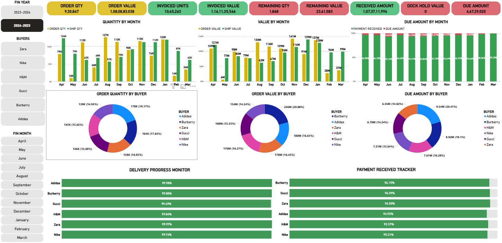

# Executive Logistics & Cash-Flow Dashboard
## MySQL + Power BI End-to-End Analytics Solution

A production-ready analytics system that consolidates order management, logistics, and payment data into executive dashboards. Built for CFO-level decision making with real-time visibility into orders, shipments, receivables, and cash flow.



## 🎯 Business Impact

**For CFO & Management:**
- **Single-view visibility** into orders, shipments, receivables, and dock-hold status
- **Cash flow planning** with due amount tracking and payment term analysis  
- **Buyer performance** monitoring with delivery progress and payment patterns
- **Risk management** through aging analysis and balance thresholds

**Key Features:**
- Buyer/Month/Year filtering across all metrics
- Fiscal year reporting (Apr-Mar) with proper sorting
- Currency conversion (USD/EUR/GBP to INR) with real-time rates
- Split order handling and partial shipment tracking
- Dock hold monitoring (shipped but AWB pending)

## 📊 Dashboard Screenshots

### Executive Dashboard Overview


### Power BI Data Model


### SQL Relationships


---

## 🏗️ Architecture

```
┌─────────────────┐    ┌──────────────────┐    ┌─────────────────┐
│   Source Tables │    │   Transformation │    │   Power BI      │
│                 │    │                  │    │                 │
│ • po_receive    │    │ • logistic_      │    │ • Executive     │
│ • invoice_raised│───▶│   details (view) │───▶│   Dashboard     │
│ • transport_bill│    │ • POWERBI_ORDERS │    │ • Buyer/Month   │
│ • payment_rcvd  │    │ • POWERBI_SHIPPED│    │   Filtering     │
│ • buyer_currency│    │ • Due Amount SQL │    │ • Fiscal        │
│ • split_qty     │    │ • AWB Pending SQL│    │   Calendar      │
└─────────────────┘    └──────────────────┘    └─────────────────┘
```

### Data Flow
1. **Source Layer**: Operational tables from order management and logistics systems
2. **Semantic Layer**: `logistic_details` view consolidates all business logic
3. **Aggregation Layer**: Stored procedures pre-aggregate for performance
4. **Presentation Layer**: Power BI with star schema and fiscal calendar

---

## 🗃️ Core SQL Components

### Central View: `logistic_details`
```sql
-- Handles split orders, currency conversion, payment integration
CREATE VIEW logistic_details AS 
WITH split_orders AS (
  -- Complex split order logic
), 
splitting AS (
  -- Invoice matching and quantity distribution
),
payment AS (
  -- Payment aggregation by order/invoice
)
SELECT ord_num, buyer, invoice_no, order_qty, ship_qty,
       price, order_value_inr, ship_value_inr, 
       payment_received_inr, delivery_date, ship_date
FROM splitting s
JOIN buyer_currency bc ON bc.id = s.buyer_id
LEFT JOIN payment pr ON pr.ord_num = s.ord_num;
```

### Stored Procedures for Power BI
- **POWERBI_ORDERS()**: Aggregates orders with 7% tolerance rule
- **POWERBI_SHIPPED()**: Shipped quantities by buyer/month  
- **Due Amount Query**: Receivables with payment terms
- **AWB Pending Query**: Dock hold items (shipped, no transport bill)

---

## 🚀 Getting Started

### Prerequisites
- MySQL 8.0+
- Power BI Desktop
- Your operational data (see data/ folder for structure)

### Quick Setup
1. **Database Setup**
   ```bash
   mysql -u root -p < sql/01_create_schema.sql
   mysql -u root -p < sql/03_logistic_details_view.sql  
   mysql -u root -p < sql/04_powerbi_procedures.sql
   ```

2. **Power BI Setup**
   - Import your data to MySQL tables
   - Connect Power BI to MySQL
   - Use custom SQL: `CALL POWERBI_ORDERS()`, `CALL POWERBI_SHIPPED()` 
   - Apply queries from sql/05_due_amount_query.sql and sql/06_awb_pending_query.sql
   - Set up relationships and fiscal calendar

3. **Add Your Data**
   - Upload CSV files to data/ folder
   - Update connection strings
   - Refresh Power BI model

---

## 📁 Repository Structure

```
Executive_Logistics_Dashboard/
├── README.md                           # This file
├── data/                              # CSV data files (add your data here)
├── sql/                               # Database scripts
│   ├── 01_create_schema.sql          # Table creation
│   ├── 03_logistic_details_view.sql  # Core semantic layer
│   ├── 04_powerbi_ORDERS_procedure.sql     # Aggregation procedure
|   ├── 04_powerbi_SHIPPED_procedure.sql     # Aggregation procedure
│   ├── 05_due_amount_query.sql       # Receivables calculation
│   └── 06_awb_pending_query.sql      # Dock hold tracking
├── powerbi/                          # Power BI assets
│   ├── screenshots/                  # Dashboard images
│   └── power_bi_setup_guide.md      # Setup instructions
└── docs/                             # Documentation
    ├── data_dictionary.md            # Table/field definitions
    └── business_requirements.md      # Requirements & use cases
```

---

## 💼 Key Business Rules

### Split Order Handling
- Orders split into multiple shipments with proportional quantity distribution
- Split orders labeled with suffix: ORD123456-S(1), ORD123456-S(2)

### Currency & Conversion  
- Real-time exchange rates for shipped items
- Buyer default rates for unshipped orders
- All reporting standardized in INR

### Balance Calculations
- **7% Tolerance**: Remaining qty ≤7% of order treated as complete
- **Thresholds**: Balances ≤$2 or ₹100 treated as zero  
- **Due Dates**: Ship date + buyer payment terms

### Fiscal Calendar
- April-March fiscal year with proper month sorting
- Cross-year reporting and period comparisons

---

## 🏆 Technical Achievements

- **Single Source of Truth**: Eliminated manual Excel reporting
- **Real-time Dashboard**: CFO visibility with current data  
- **60% Time Reduction**: Automated month-end reporting process
- **Data Quality**: Reconciliation rules ensure accurate balances
- **Scalable Design**: Handles growing data volumes efficiently

---

## 🔧 Performance Features

- **SQL Aggregation**: Pre-computed metrics reduce Power BI load
- **Indexed Views**: Optimized query performance  
- **Stored Procedures**: Encapsulated business logic
- **Fiscal Calendar**: DAX-generated calendar reduces model size
- **Threshold Rules**: Eliminate noise from small amounts


---

## 📝 Project Notes

**Technologies Used:**
- MySQL (Views, Stored Procedures, Complex Joins)
- Power BI (DAX, Relationships, Custom Visuals)
- SQL (CTEs, Window Functions, Fiscal Logic)

**Business Domain:**
- Logistics & Supply Chain
- Order-to-Cash Process  
- Financial Reporting & Analytics
- Executive Dashboards

---

**⭐ Star this repo if you find it useful for your analytics projects!**

This project demonstrates production-quality analytics engineering skills suitable for Data Analyst, BI Developer, and Analytics Engineer roles.
